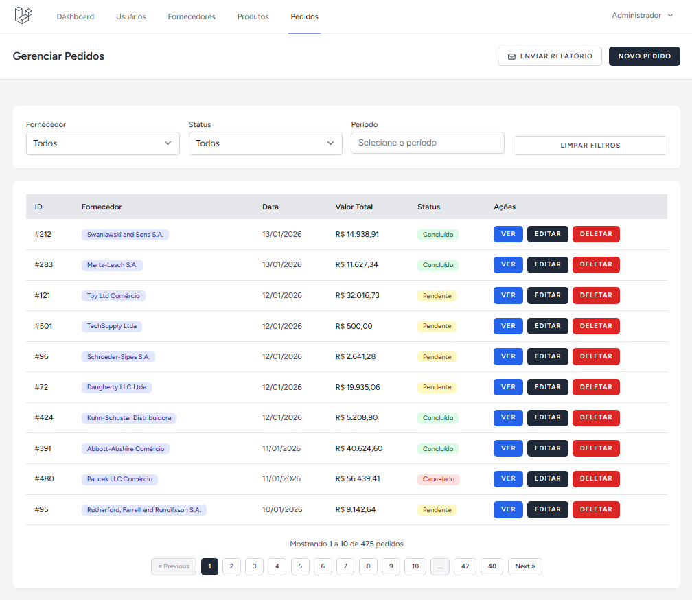

# ERP Pedidos

Este é um protótipo de sistema de gestão de pedidos com autenticação, autorização por perfil, importação de produtos via CSV processada em background, API REST, cache inteligente com Redis e relatórios automatizados.
Pretendo revisitá-lo futuramente para adicionar melhorias como mais componentizações no frontend, testes automatizados e outras funcionalidades.



## Funcionalidades

🔒 **Autenticação e Autorização** - Sistema multi-perfil (Admin e Vendedor) com controle de acesso granular  
📦 **Gestão de Fornecedores** - CRUD com validação de CNPJ e integração ViaCEP para endereços  
🏷️ **Catálogo de Produtos** - Cadastro manual ou importação em lote via CSV com processamento assíncrono  
📋 **Pedidos Inteligentes** - Criação via interface web ou API REST com validação de permissões por fornecedor  
⚡ **Cache Redis** - Lista de produtos em cache para performance otimizada em pedidos  
📊 **Dashboard Analítico** - Visão consolidada de vendas dos últimos 30 dias com cache  
📧 **Relatórios Agendados** - Email diário automático (08:00) com resumo de pedidos dos últimos 7 dias  
🔌 **API REST** - Endpoints completos para autenticação, consulta e gestão de pedidos  

## Stack

**Backend:** Laravel 12 (PHP 8.3) • MySQL 8.0 • Redis  
**Frontend:** Vue.js 3 • Inertia.js • Vite • DaisyUI • Tailwind CSS  
**Infra:** Docker • Nginx • Supervisor • Mailpit

## Pré-requisitos

- Docker Compose
- Git

## Instalação

**1. Clone e configure o ambiente:**
```bash
git clone git@github.com:gustavobotti/erp-pedidos.git
cd erp-pedidos
cp .env.example .env
```

**2. Suba os containers:**
```bash
docker compose up -d
```

**3. Instale dependências e configure:**
```bash
# Dependências PHP
docker compose exec app composer install

# Gerar APP_KEY
docker compose exec app php artisan key:generate

# Rodar migrations
docker compose exec app php artisan migrate

# Seeders (opcional - cria dados de exemplo)
docker compose exec app php artisan db:seed
```

**4. Ajustar permissões (Linux/Mac):**
```bash
docker compose exec app chown -R erp:erp /var/www
docker compose exec app chmod -R 775 /var/www/storage /var/www/bootstrap/cache
```

## Acesso

| Serviço | URL |
|---------|-----|
| **Aplicação** | http://localhost:8000 |
| **Mailpit** | http://localhost:8025 |
| **Vite (dev)** | http://localhost:5173 |

## Comandos Úteis

```bash
# Logs
docker compose logs -f app

# Artisan
docker compose exec app php artisan [comando]

# Composer
docker compose exec app composer [comando]

# Limpar cache
docker compose exec app php artisan cache:clear

# Resetar banco com seeders
docker compose exec app php artisan migrate:fresh --seed

# Parar containers
docker compose stop

# Remover tudo
docker compose down -v
```

## Containers

| Container | Função |
|-----------|--------|
| **erp_app** | PHP 8.3-FPM + Supervisor (workers) |
| **erp_nginx** | Servidor web (porta 8000) |
| **erp_mysql** | Banco de dados |
| **erp_redis** | Cache e filas |
| **erp_mailpit** | Captura emails (dev) |
| **erp_node** | Vite dev server (hot reload) |

## Recursos

- Supervisor configurado para Laravel Queue Workers
- Redis para cache e filas
- Volumes persistentes (mysql_data, vendor_data, node_modules_data)
- Hot reload automático com Vite
