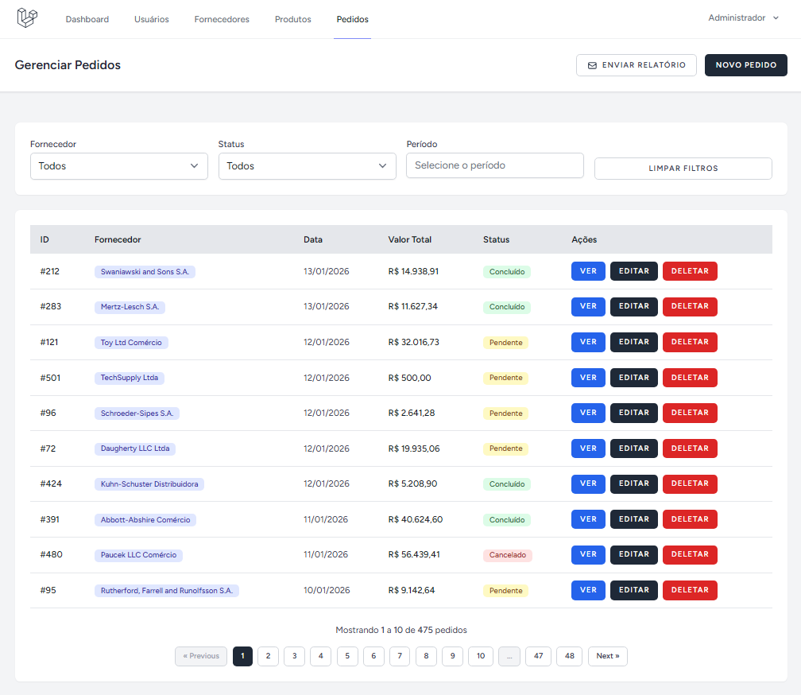

# ERP Orders
Order management system - Laravel + Vue.js + Docker

## Prerequisites
Docker, Docker Compose

## How to Run
```bash
# 1. Clone the project
git clone git@github.com:gustavobotti/erp-pedidos.git
cd erp-pedidos

# 2. Set up the environment
cp .env.example .env

# 3. Start the containers (everything is configured automatically!)
docker-compose up -d
```
Wait a moment and visit: **http://localhost:8000**

### First Access
**Default credentials:**
- Email: `admin@erp.com`
- Password: `password`

## Access
- **App:** http://localhost:8000
- **Emails (Mailpit):** http://localhost:8025

---

## Technologies
- **Backend:** Laravel 12 (PHP 8.3)
- **Frontend:** Vue.js 3 + Inertia.js
- **Styling:** Tailwind CSS + DaisyUI
- **Database:** MySQL 8.0
- **Cache/Queue:** Redis
- **Build Tool:** Vite
- **Email Testing:** Mailpit

---

## Useful Commands
```bash
# View logs in real time
docker-compose logs -f app      # Laravel/PHP
docker-compose logs -f node     # Vite/Vue.js
docker-compose logs -f nginx    # Web server

# Reset from scratch (deletes ALL data!)
docker-compose down -v
docker-compose up -d
```

## Docker will automatically
> - Install PHP dependencies (composer)
> - Install Node.js dependencies (npm)
> - Generate the application key
> - Create and seed the database
> - Configure Ziggy routes
> - Compile Vue.js assets with Vite
> - Adjust permissions
